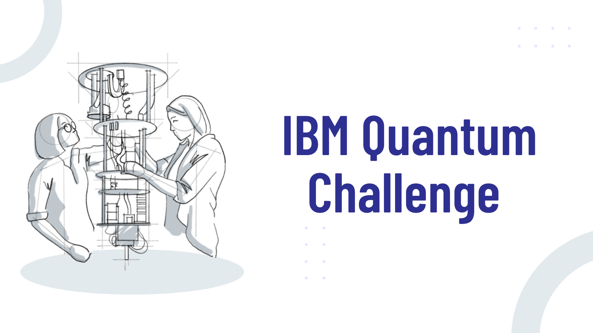

# [IBM Quantum Challengeで学ぶ量子コンピューティング](https://quantum-tokyo.github.io/ibm-quantum-challenge-textbook/)
IBM Quantum Challengeを題材とした量子コンピューティングの学習教材です。

IBM Quantum Challenge は IBM が主催する量子コンピューターのプログラミングコンテストのことで、2019 年から開催されています。  
オープンソースの量子開発キットの Qiskit を活用して、量子コンピューティングに関する基礎から応用までを学びながら腕を競っています。

本教材では過去の Quantum Challenge の問題を扱いながら量子コンピューティングを学ぶことを目的としています。
