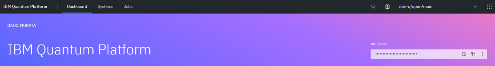

# IBM Quantum Challengeで学ぶ量子コンピューティング

このページは Quantum Tokyoコミュニティが作成した、IBM Quantum Challenge を題材とした量子コンピューティングの学習教材です。

IBM Quantum Challenge は2019年から IBM 主催で開催されている量子コンピュータのイベントです。    
オープンソース開発キットの Qiskit を使って、量子コンピューティングに関する問題に取り組みます。

本教材では過去の Quantum Challenge の問題を扱いながら量子コンピューティングの基礎を学部ことが出来ます

## What's NEW
2024/6/20 Quantum Challenge2024 (Lab4) を追加しました。  
2024/6/18 Qiskit Runtime PrimitivesのLabをPrimitivesV2に対応させました。  
2024/6/15 Quantum Challenge2024 (Lab0-3) を追加しました。  


## 目次
```{tableofcontents}

```

## Labを始める前に
一部のLabでは実行するにあたってIBM QuantumのAPIトークンを必要とするものがあります。  
自分でハンズオンを進めたい方は以下の手順に沿ってAPIトークン情報の配置を行ってください。



1.   [IBM Quantum Platform](https://quantum.ibm.com/)に移動します。
1.   右上にある API トークン (上の図参照) をクリックしてコピーします。
1.   このプロジェクトのルートディレクトリの配下に`.env`ファイルを作成します。
1.   `.env.sample`を参考に、3でコピーしたAPI トークンを`QXToken`の値に貼り付けます。

```
QXToken=[.envを作成し、ここにAPIトークンを貼り付けます]
```